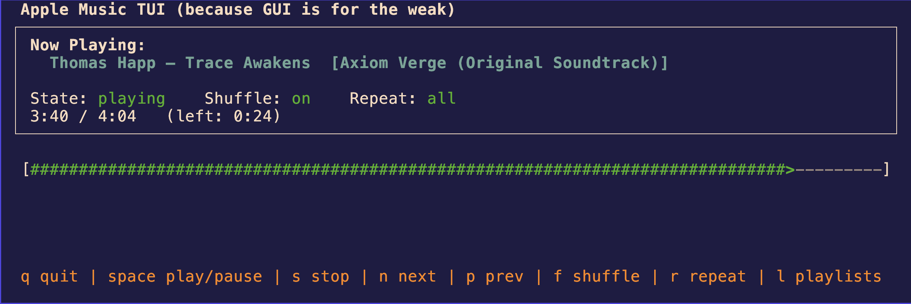

# music_tui

`music_tui` is a terminal-based (ncurses) controller for **Apple Music on macOS**.  
It provides a keyboard-driven TUI for playback control, now-playing status, progress tracking, and playlist selection — all without leaving the terminal.

This project uses **Python**, **curses**, and **AppleScript (osascript)** to control the native Music app. No DRM hacks, no reverse engineering, and no browser tabs were harmed.

---



## Features

- Full-screen ncurses TUI
- Now Playing display (artist, track, album)
- Playback state indicator (playing / paused / stopped)
- Progress bar with elapsed time and time remaining
- Keyboard controls for:
  - Play / pause toggle
  - Stop
  - Next / previous track
- Playlist browser
  - Enumerates user playlists
  - Keyboard navigation
  - Play selected playlist
- Pure terminal workflow (works well with tmux / Kitty panes)

---

## Requirements

- macOS
- Python 3.9+ (system Python is fine)
- Apple Music app
- Terminal with curses support (Terminal.app, iTerm2, Kitty, etc.)

No third-party Python libraries are required.

**NOTE:** Python can be installed on MacOS via homebrew. For example, if you wanted to install Python version 3.13:

```bash
brew install python@3.13
```

---

## Installation

Clone the repository:

```bash
git clone https://github.com/asyrewicze/music_tui.git
cd music_tui
```

Make the script executable:

```bash
chmod +x music_tui.py
```

---

## Usage

Run the TUI:

```bash
./music_tui.py
```

The Music app does not need to be running beforehand; macOS will launch it automatically if required.

---

## Keyboard Controls

### Main View

| Key | Action |
|---|---|
| Space | Play / pause toggle |
| n | Next track |
| p | Previous track |
| s | Stop |
| l | Open playlist browser |
| q | Quit |

### Playlist Browser

| Key | Action |
|---|---|
| Up / Down | Navigate playlists |
| j / k | Navigate playlists (Vim-style) |
| Enter | Play selected playlist |
| b or Esc | Return to main view |
| q | Quit |

---

## Permissions (Important)

macOS requires explicit permission for terminal applications to control other apps.

On first run, you may be prompted to allow your terminal to control **Music**.

If nothing responds:

1. Open **System Settings**
2. Go to **Privacy & Security → Automation**
3. Allow your terminal application (Terminal, iTerm2, Kitty, etc.) to control **Music**

Without this permission, AppleScript commands will silently fail.

---

## How It Works

- The TUI is rendered using Python `curses`
- Playback and metadata are queried via `osascript`
- Apple Music’s scripting dictionary provides:
  - Player state
  - Current track metadata
  - Playback position
  - Playlist enumeration
- Playlists are enumerated safely using manual AppleScript iteration to avoid list coercion issues

This approach uses Apple’s supported automation interfaces and is resilient across macOS updates.

---

## Limitations

- macOS only (depends on AppleScript)
- No album art (ncurses is character-cell based)
- Playlist selection is name-based (duplicate playlist names may resolve unpredictably)

---

## Possible Future Enhancements

- Playlist search and filtering
- Volume control
- Persistent state (last playlist, last view)
- Playing by persistent playlist ID instead of name
- Kitty/iTerm-specific enhancements (optional, non-portable)

---

## License

MIT License

---

## Disclaimer

This project is not affiliated with or endorsed by Apple.  
Apple Music and macOS are trademarks of Apple Inc.
